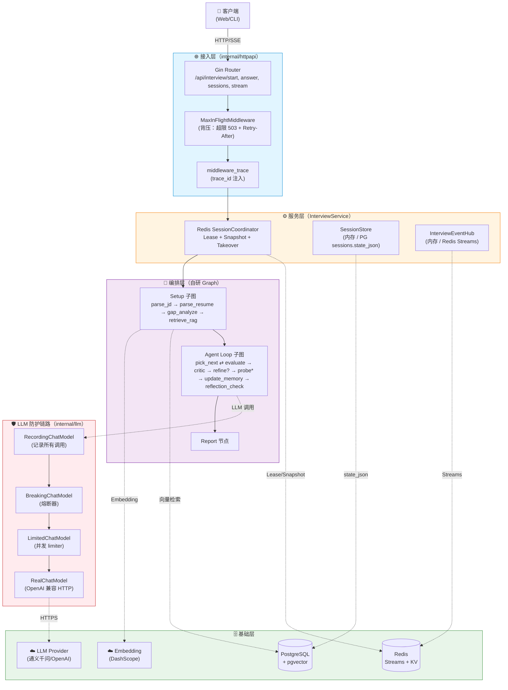
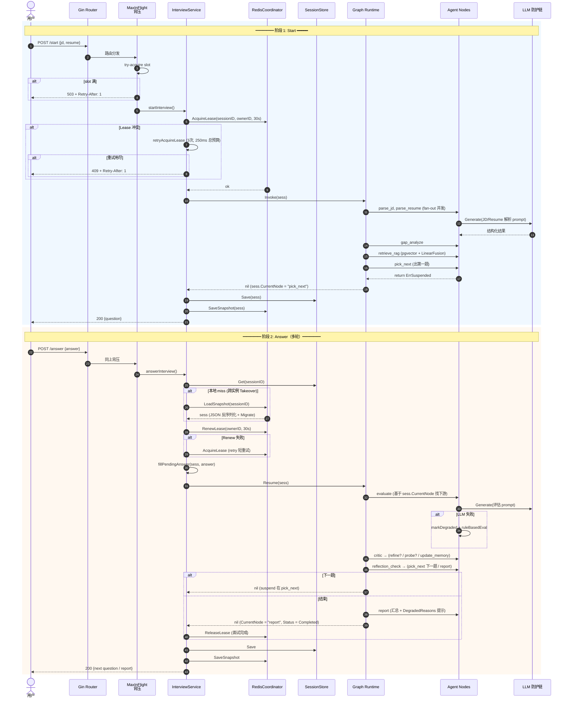
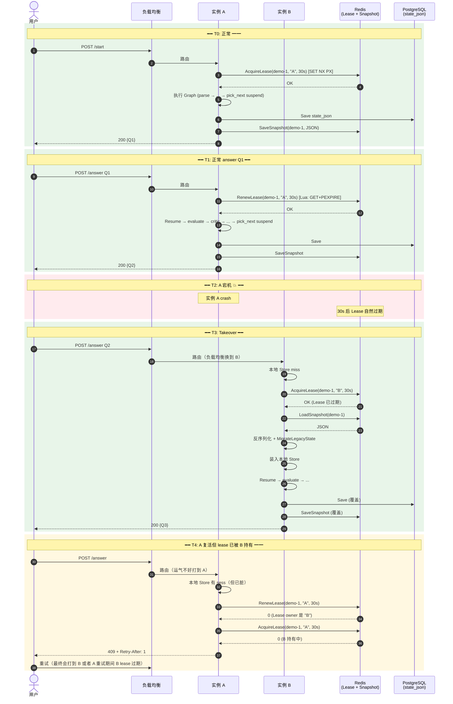
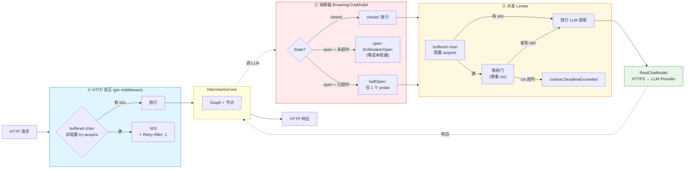
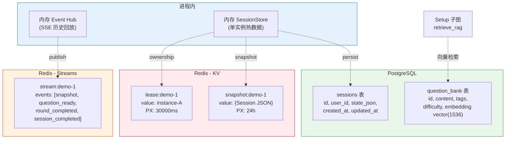

# 系统架构总览

> 用途：面试开场 1-2 分钟为项目面的"开场篇"
> 阅读顺序：先看图，再读图下的说明
> 配套：每个亮点都有独立深度文档（见 `03-亮点1-自研Graph框架.md` 等）

---

## 一、三层架构图



---

## 二、请求生命周期（start + answer 流程）



---

## 三、Graph DAG（9 节点编排详图）

```mermaid
flowchart LR
    Start(["▶️ START"]) --> ParseJD["parse_jd<br/>解析 JD"]
    Start --> ParseRes["parse_resume<br/>解析简历<br/>(fan-out 并发)"]

    ParseJD --> Gap["gap_analyze<br/>对比 JD/简历差距"]
    ParseRes --> Gap

    Gap --> RAG["retrieve_rag<br/>pgvector + LinearFusion<br/>多路融合检索"]

    RAG --> Pick["🎯 pick_next<br/>挑下一题"]

    Pick -->|"return ErrSuspended<br/>(等用户答)"| Suspend1{{"⏸ SUSPENDED<br/>等 answer"}}

    Suspend1 -->|Resume| Eval["evaluate<br/>LLM 评分"]
    Eval --> Critic["critic<br/>判断信号<br/>(需要 refine?<br/>需要 probe?)"]

    Critic -->|signals.NeedsRefine| Refine["refine<br/>二次评估"]
    Critic -->|signals.HasProbeSignal| ProbeAsk["probe_ask<br/>追问"]
    Critic -->|none| Update["update_memory<br/>更新覆盖度<br/>降级计数器"]

    Refine -->|HasProbeSignal| ProbeAsk
    Refine -->|none| Update

    ProbeAsk -->|"return ErrSuspended"| Suspend2{{"⏸ SUSPENDED<br/>等追问 answer"}}
    Suspend2 -->|Resume| ProbeEval["probe_eval"]
    ProbeEval -->|继续追问| ProbeAsk
    ProbeEval -->|追问完毕| Update

    Update --> Reflect["reflection_check<br/>决定下一步"]

    Reflect -->|还有预算 + 需要补漏<br/>(ReflectTopic)| Pick
    Reflect -->|预算耗尽 / 覆盖度足够| Report["📊 report<br/>汇总 + DegradedReasons 提示"]

    Report --> End(["⏹ END"])

    style Suspend1 fill:#fff3e0,stroke:#e65100,stroke-dasharray: 5 5
    style Suspend2 fill:#fff3e0,stroke:#e65100,stroke-dasharray: 5 5
    style Pick fill:#e3f2fd,stroke:#1976d2
    style Report fill:#e8f5e9,stroke:#388e3c
    style Critic fill:#f3e5f5,stroke:#7b1fa2
```

**关键说明**：

| 元素 | 含义 |
|---|---|
| 🎯 `pick_next` | 每次循环回到这里挑下一题，然后 suspend 等用户答 |
| ⏸ `SUSPENDED` | 节点 return `ErrSuspended`，runtime 暂停等外部 `Resume` |
| 实线箭头 | 静态 edge |
| 多分支 | `Router` 函数根据 Session 状态决定走哪条 |
| 虚线圆角 | 暂停态（用户在思考答题）|

---

## 四、跨实例 Takeover 时序图



---

## 五、三层防护链路示意



**关键设计**：

> 越靠外越快 fail-fast（O(1) chan 检查 → O(1) 状态检查 → 可能阻塞等待 → 真实 HTTP 调用）

---

## 六、数据存储分布



**各存储的职责**：

| 存储 | 角色 | TTL | 失败时降级行为 |
|---|---|---|---|
| 内存 Store | 单实例热数据 | 进程生命周期 | 重启丢失（依赖 PG/Redis 恢复）|
| PG `sessions.state_json` | 持久化全量 session | 永久 | 失败阻断（数据正确性边界）|
| PG `question_bank` | 题库 + 向量 | 永久 | 失败 → fallback 本地题库 |
| Redis Lease | Ownership 边界 | 30s | **失败必须阻断**（多实例所有权）|
| Redis Snapshot | 跨实例 takeover 状态 | 24h | 写失败可降级（记 DegradedReasons）|
| Redis Streams | SSE 事件分发 | 自然过期 | 失败可降级（订阅者 Last-Event-ID 重连补齐）|

---

## 七、目录结构与代码组织

```
interview-agent/
├── cmd/
│   ├── server/           # HTTP 服务入口（装配三层防护、Coordinator、Graph）
│   ├── demo/             # 离线 CLI demo（YAML 脚本驱动整图，产 run.json + report.md）
│   └── reindex/          # 离线工具：题库 embedding 重建
├── internal/
│   ├── config/           # YAML + 环境变量配置加载与校验
│   ├── domain/           # ⭐ 领域模型聚合根 Session, WorkingMemory, Report
│   │   └── migration.go  # 旧状态向强类型字段迁移
│   ├── graph/            # ⭐ 自研轻量 Graph 框架（NodeFunc + Router + Suspend/Resume）
│   ├── graphs/           # 业务图组装（BuildInterviewGraph）
│   ├── nodes/            # ⭐ 9 个 Agent 节点 + Router + 降级逻辑 + prompts
│   ├── llm/              # ⭐ ChatModel 抽象 + Real/Mock/Stub + 防护装饰器
│   │   ├── breaker.go    # 熔断器
│   │   ├── limited.go    # 并发 limiter
│   │   ├── recording.go  # 调用记录
│   │   ├── schema.go     # CallWithSchema 自纠重试
│   │   └── factory.go    # 装配链路
│   ├── embedding/        # Embedder 抽象 + Real/Mock
│   ├── retriever/        # ⭐ pgvector Retriever + LinearFusion 多路融合
│   ├── parser/           # PDF / DOCX 简历解析
│   ├── httpapi/          # ⭐ HTTP handler + 背压 + Redis Coordinator + Session Store + SSE
│   └── observability/    # slog + RecordingCallback
├── migrations/           # PG schema migration
├── seeds/                # question_bank.json
├── config/               # config.yaml 模板
├── scripts/              # smoke.sh / smoke.ps1 / smoke_sse.ps1
├── docs/                 # 设计文档 + 项目讲解（本目录）
└── docker-compose.yml    # 一键起 PG + Redis
```

**⭐ 标记的目录是亮点集中地**，每个对应一份独立深度文档。

---

## 八、技术栈一览

| 维度 | 选型 | 替代方案 | 选择理由 |
|---|---|---|---|
| 语言 | **Go 1.25+** | Java / Python | 部署简单（单 binary）、并发模型契合 Agent / 性能好 |
| HTTP 框架 | **Gin** | Echo / net/http | 生态成熟 / middleware 链路易组合 |
| DB | **PostgreSQL** | MySQL | 原生 JSON 类型 + pgvector 扩展支持向量 |
| 向量库 | **pgvector** | Milvus / Qdrant | 不引入新服务，与业务表事务一致 |
| 缓存 / 协调 | **Redis** | Memcached / etcd | KV + Streams + Lua 一栈搞定 lease/snapshot/event |
| LLM | **OpenAI 兼容**（通义千问）| Claude / Gemini | 国内合规 + 价格低 + 兼容性好 |
| Embedding | **DashScope text-embedding-v3** | OpenAI / Cohere | 1536 维 / 与通义千问同生态 |
| 配置 | **YAML + ENV** | TOML | YAML 易读 / API key 强制走 ENV |
| 日志 | **slog**（Go 1.21+ 标准库）| zerolog / zap | 标准库优先 / 结构化 / 性能足够 |
| Graph 框架 | **自研**（~500 行）| Eino / LangGraph | 强约束 + 边界小 + 完全可控（见亮点 1）|
| 测试 | testify + 表驱动 + INTEGRATION=1 控制集成 | - | Go 标准实践 |

---

## 九、面试时如何用这套图（30 秒 / 2 分钟 / 5 分钟版）

### 30 秒版（开场）

> "项目是基于自研 Graph 框架的分布式 AI 面试评估系统。三层架构：接入层做背压保护、服务层管 Session 协调（多实例 Lease + Redis Snapshot Takeover）、编排层用自研 Graph 串 9 个 Agent 节点。"

### 2 分钟版（项目面 8 分钟里的开场）

> [指三层架构图]
>
> "整个系统分三层。**接入层**用 Gin + MaxInFlight 背压中间件，超载立刻 503 + Retry-After。
>
> **服务层**是 InterviewService，做三件事：通过 Redis Coordinator 维护 Session Ownership Lease，通过 SessionStore 抽象内存/PG/Redis 三种存储，通过 EventHub 给 SSE 推流。
>
> **编排层**是我自研的轻量 Graph 框架，串了 9 个 Agent 节点，分 Setup 子图和 Agent loop 子图，loop 子图里靠 `pick_next` 节点 `return ErrSuspended` 实现挂起，HTTP 层填好用户答案后调 `Runnable.Resume` 从下游继续。
>
> 调外部 LLM 走三层防护链路：Recording → Breaker → Limiter → Real，每层各自管不同失败模式。
>
> 最底层是 PG（state_json + pgvector）和 Redis（KV + Streams + Lua）。"

### 5 分钟版（深度展示）

> 在 2 分钟版基础上加：
> - 跨实例 Takeover 时序图（重点讲 Lease 冲突的双层重试）
> - 三层防护链路图（讲为什么是这个顺序）
> - Graph DAG 图（讲 9 个节点的循环和 router 分支）

---

## 十、相关文档导航

| 想了解什么 | 看哪份 |
|---|---|
| 简历怎么写、面试怎么开场 | `00-简历项目描述.md` |
| 30 个常见面试问题的答案 | `99-面试QA清单.md` |
| 自研 Graph 框架细节 | `03-亮点1-自研Graph框架.md` |
| 多实例协调 / Lease / Takeover | `04-亮点2-多实例分布式协调.md` |
| 熔断 / 限流 / 背压 | `05-亮点3-三层防护体系.md` |
| 显式降级 / DegradedReasons | `06-亮点4-显式降级与可观测性.md` |
| RAG 多路融合 | `07-亮点5-RAG检索与题库.md`（待生成）|
| SSE + 断线回放 | `08-亮点6-SSE流式与事件总线.md`（待生成）|
| 领域模型演进 | `09-亮点7-领域模型演进.md`（待生成）|
| 工程化与测试 | `10-亮点8-工程化与测试.md`（待生成）|
