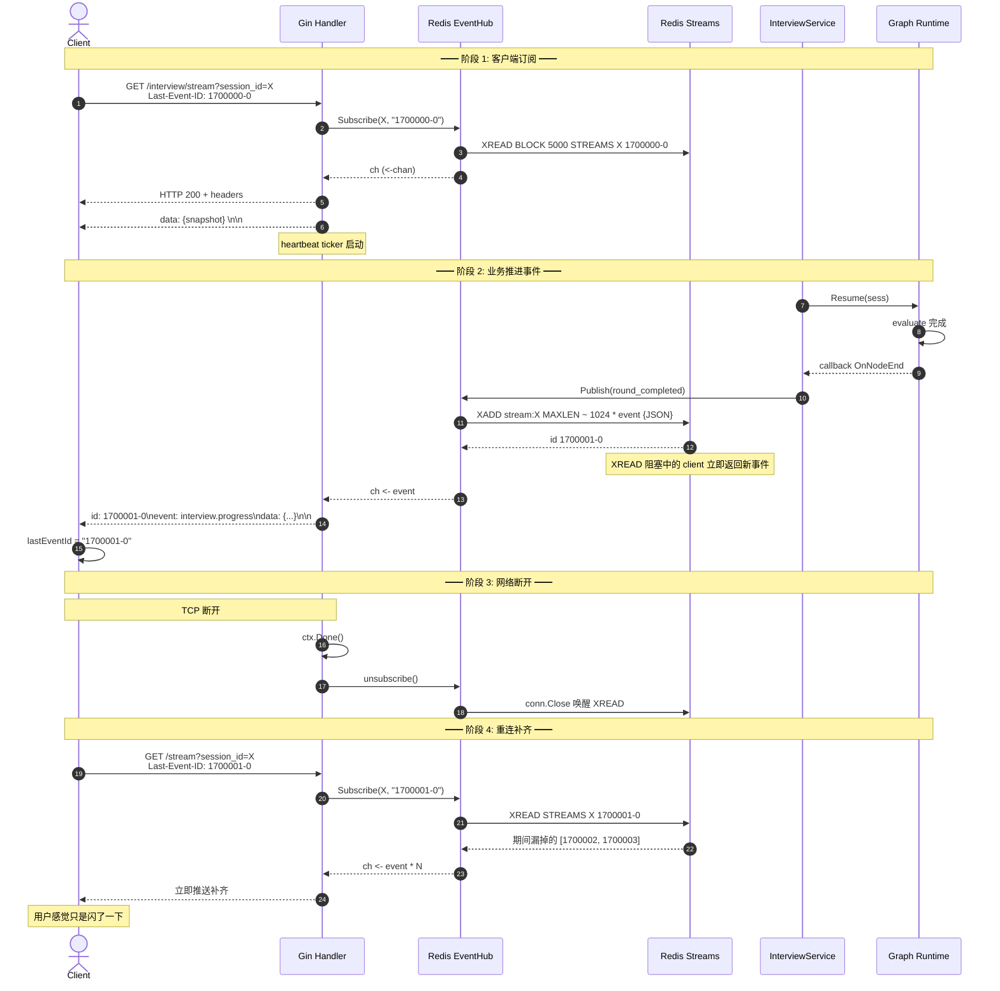

# 亮点 6：SSE 流式与跨实例事件总线（Last-Event-ID 断线回放）

> 代码位置：`internal/httpapi/interview_stream.go`、`interview_events.go`、`redis_event_hub.go`
> 关键能力：实时进度推送 + 断线重连补齐 + 多实例事件分发
> 面试官追问命中率：★★★★（实时推送是面试的常考话题）

---

## TL;DR（30 秒讲清楚版）

> 项目通过 SSE 给前端推实时进度（节点完成、新题就绪、报告生成）：
>
> 1. **协议层**：标准 SSE（`Content-Type: text/event-stream` + `id:` + `event:` + `data:` + 双 \n），15 秒心跳防代理超时
> 2. **断线重连**：标准 `Last-Event-ID` header（也兼容 query string），订阅时从该 ID 后回放，**对网络抖动透明**
> 3. **EventHub 抽象**：内存版（开发态、单实例）+ **Redis Streams 版**（多实例 fan-out）通过同一接口，业务代码无感知
> 4. **手写 RESP 协议解析器**（~120 行）替代 go-redis 依赖，**XADD MAXLEN ~ 1024** 自动裁剪流，避免 Redis 内存爆炸
> 5. **失败降级**：publish 失败计数 + log，**不阻断主流程**——SSE 是观察通道，不是主路径

---

## 一、为什么用 SSE 而不是 WebSocket / 轮询

| 方案 | 优点 | 缺点 | 是否合适 |
|---|---|---|---|
| **轮询**（HTTP 短连接 + 间隔 GET）| 实现简单 | 实时性差、流量浪费 | ❌ 用户等几秒看进度难受 |
| **WebSocket**（双向）| 全双工、低延迟 | 需要单独的协议升级、断线管理复杂、proxy 兼容差 | ⚠️ 业务是**单向推送**，全双工是浪费 |
| ✅ **SSE**（HTTP 长连接 + chunked）| 标准 HTTP、proxy 兼容好、断线重连原生支持 | 单向 server → client | 业务是单向推送（进度通知），完美匹配 |

**核心匹配点**：

> 这个业务是 **单向 server → client 推送**（节点完成、新题、报告），用户的"答题"走独立 POST `/answer`。SSE 完美契合，比 WebSocket 简单一半。

---

## 二、SSE 协议实现细节

### 2.1 完整 handler

```go
const interviewSSEHeartbeatInterval = 15 * time.Second

func (s *Server) streamInterview(c *gin.Context) {
    sessionID := c.Query("session_id")
    if sessionID == "" {
        c.JSON(http.StatusBadRequest, gin.H{"error": "session_id is required"})
        return
    }

    // 取 Last-Event-ID（支持 header 和 query 两种方式）
    lastEventID := c.GetHeader("Last-Event-ID")
    if lastEventID == "" {
        lastEventID = c.Query("last_event_id")
    }

    events, unsubscribe, err := s.interview.Subscribe(c.Request.Context(), sessionID, lastEventID)
    if err != nil {
        c.JSON(http.StatusInternalServerError, gin.H{"error": err.Error()})
        return
    }
    defer unsubscribe()

    // 必须支持 Flusher 才能 SSE
    flusher, ok := c.Writer.(http.Flusher)
    if !ok {
        c.JSON(http.StatusInternalServerError, gin.H{"error": "streaming not supported"})
        return
    }

    // 关键 SSE headers
    c.Header("Content-Type", "text/event-stream")
    c.Header("Cache-Control", "no-cache")
    c.Header("Connection", "keep-alive")
    c.Header("X-Accel-Buffering", "no")  // ★ 关键：禁用 Nginx 缓冲
    c.Status(http.StatusOK)

    // 立即推一个 snapshot 让前端拿到当前完整状态
    if err := writeInterviewSSE(c.Writer, buildInterviewEvent(interviewEventSnapshot, sess, "", "")); err != nil {
        return
    }
    flusher.Flush()

    heartbeat := time.NewTicker(interviewSSEHeartbeatInterval)
    defer heartbeat.Stop()

    for {
        select {
        case <-c.Request.Context().Done():
            return                                          // 客户端断开
        case <-heartbeat.C:
            // 注释行心跳：`: ping\n\n`，浏览器忽略，proxy 视为活跃流量
            if err := writeInterviewSSEComment(c.Writer, "ping"); err != nil {
                return
            }
            flusher.Flush()
        case event, ok := <-events:
            if !ok {
                return
            }
            if err := writeInterviewSSE(c.Writer, event); err != nil {
                return
            }
            flusher.Flush()
        }
    }
}
```

### 2.2 五个工程细节（每个都能讲）

#### ① X-Accel-Buffering: no（最容易踩的坑）

**现象**：本地 dev 环境 SSE 完美工作，过了 Nginx/CDN 后前端接收延迟几秒甚至完全收不到。

**原因**：Nginx 默认会**缓冲下游响应**直到攒够一定字节数才转发，对 SSE 是灾难。

**解决**：

```go
c.Header("X-Accel-Buffering", "no")
```

**这一个 header 我踩过坑**——只有遇到才会知道。

#### ② 立即推 snapshot（首屏体验）

```go
// 客户端连上立刻推一个完整 session 状态
writeInterviewSSE(c.Writer, buildInterviewEvent(interviewEventSnapshot, sess, "", ""))
```

**为什么需要**：

- 客户端刷新页面 / 切设备时，订阅的瞬间还没有新事件
- 不推 snapshot 客户端会显示"加载中..."直到下一个事件触发
- 推 snapshot 让前端**立刻渲染当前状态**，再补流式增量

#### ③ 心跳：注释行而非空 event

```go
func writeInterviewSSEComment(w http.ResponseWriter, comment string) error {
    _, err := fmt.Fprintf(w, ": %s\n\n", comment)   // 行首冒号 = SSE 注释
    return err
}
```

**为什么用注释行**：

- SSE 规范：行首 `:` 是注释，浏览器/EventSource API 会**自动忽略**
- 不会触发前端 onmessage 回调（不污染业务逻辑）
- 但对 Nginx/Cloudflare 等代理而言**就是数据**，证明连接活跃，不会触发 idle timeout

**为什么 15 秒**：

- Nginx 默认 `proxy_read_timeout 60s`，AWS ALB 默认 60s
- 15 秒间隔有 4 倍冗余，扛得住短暂网络抖动

#### ④ 标准 SSE 帧格式

```go
func writeInterviewSSE(w http.ResponseWriter, event InterviewEvent) error {
    raw, _ := json.Marshal(buildInterviewStreamEvent(event))

    // 关键三件套：id + event + data
    if event.ID != "" {
        fmt.Fprintf(w, "id: %s\n", event.ID)
    }
    fmt.Fprintf(w, "event: %s\n", publicEvent.Type)
    fmt.Fprintf(w, "data: %s\n\n", raw)   // 空行结束帧
    return nil
}
```

**SSE 协议要点**：

- `id:` → 客户端 EventSource 会自动记 `lastEventId`
- `event:` → 触发对应类型的 listener（`addEventListener('interview.completed', ...)`）
- `data:` → JSON 字符串
- **必须以 `\n\n`（空行）结束**，否则客户端不会触发 onmessage

#### ⑤ 客户端可见的事件类型映射

```go
func publicInterviewEventType(eventType string) string {
    switch eventType {
    case interviewEventSnapshot:                                 return "snapshot"
    case interviewEventSessionCompleted:                         return "interview.completed"
    case interviewEventSessionFailed, interviewEventNodeError:   return "interview.failed"
    default:                                                     return "interview.progress"
    }
}
```

**为什么要做映射**：

- 内部事件名包含实现细节（`session_completed` / `node_error` / `round_completed`...）
- 客户端只关心**少量有语义的类型**（snapshot / progress / completed / failed）
- 内部增加新事件类型时，对客户端**默认归到 progress**，不影响现有 listener
- 这是**接口稳定性**的工程纪律

---

## 三、Last-Event-ID 断线重连机制

### 3.1 浏览器原生支持

```javascript
const es = new EventSource('/api/interview/stream?session_id=demo-1')
es.onmessage = (e) => console.log(e.data)
es.onerror = (e) => {
    // 断线时浏览器自动重连，并在 header 里带 Last-Event-ID
}
```

**关键事实**：浏览器原生 `EventSource` 自动处理重连：

- 监听到响应里 `id: xxx` → 记录到 `lastEventId`
- 连接断开 → 自动重试（默认 3 秒后）
- 重连请求会**自动带上 `Last-Event-ID: xxx` header**

### 3.2 服务端兼顾 header + query

```go
lastEventID := c.GetHeader("Last-Event-ID")
if lastEventID == "" {
    lastEventID = c.Query("last_event_id")  // 兼容不能改 header 的客户端
}
```

**为什么要 query 兜底**：

- 浏览器 EventSource API **不支持自定义 header**（除非用 polyfill）
- 移动端原生 / RN / 小程序的 SSE 客户端 API 各异，可能不支持 header
- query string 是万能 fallback

### 3.3 Subscribe 从 lastID 开始回放

**内存版**（`MemoryInterviewEventHub`）：

```go
type MemoryInterviewEventHub struct {
    mu      sync.Mutex
    history map[string][]InterviewEvent  // sessionID → 历史事件
    subs    map[string][]chan InterviewEvent
}

func (h *MemoryInterviewEventHub) Subscribe(ctx, sessionID, afterID string) (<-chan InterviewEvent, func(), error) {
    ch := make(chan InterviewEvent, 64)

    h.mu.Lock()
    history := h.history[sessionID]
    h.mu.Unlock()

    // 从 afterID 之后的位置开始 replay
    startIdx := findEventIndex(history, afterID) + 1
    for _, ev := range history[startIdx:] {
        ch <- ev
    }

    // 然后开始接收 live 事件
    h.mu.Lock()
    h.subs[sessionID] = append(h.subs[sessionID], ch)
    h.mu.Unlock()

    return ch, func() { /* unsubscribe */ }, nil
}
```

**Redis Streams 版**：

```go
// Redis Streams 原生支持"从某个 ID 之后读"
res, _ := redisDo(conn,
    "XREAD", "BLOCK", strconv.FormatInt(h.opts.Block.Milliseconds(), 10),
    "COUNT", "32",
    "STREAMS", stream, lastID,   // ← 从 lastID 之后开始
)
```

**对客户端的承诺**：

> **断线 → 重连 → 自动补齐期间漏掉的事件，对用户无感知**。这是 SSE 比 WebSocket 强的地方（WebSocket 自己实现"补齐"非常麻烦）。

---

## 四、EventHub 抽象（内存 vs Redis Streams）

### 4.1 接口定义

```go
type InterviewEventHub interface {
    Publish(ctx context.Context, event InterviewEvent) InterviewEvent
    Subscribe(ctx context.Context, sessionID string, afterID string) (<-chan InterviewEvent, func(), error)
    Close() error
}
```

### 4.2 两种实现

| 实现 | 用途 | 部署 | 跨实例 |
|---|---|---|---|
| `MemoryInterviewEventHub` | dev / 单实例 / 测试 | 无依赖 | ❌ |
| `RedisInterviewEventHub` | 多实例生产 | 依赖 Redis | ✅ Streams 天然 fan-out |

### 4.3 Redis Streams 选型理由

| 方案 | 优点 | 缺点 | 是否选 |
|---|---|---|---|
| Redis Pub/Sub | 简单、低延迟 | **fire-and-forget**，订阅前的事件丢失 | ❌ 不能做 Last-Event-ID 回放 |
| Redis List + LPUSH/BRPOP | 持久化 | 单消费 / 没法 broadcast 给多个订阅者 | ❌ 同一 session 多客户端订阅就废了 |
| ✅ Redis Streams | **持久化 + 多消费者 + ID 可回放** | 内存占用 | ✅ 完美匹配 |
| Kafka | 强保证、规模大 | 部署复杂 | ⚠️ ROI 不划算 |

> **Redis Streams 是这个业务场景的最佳匹配**：每条事件有唯一 ID，多个客户端可以独立从任意 ID 后读。

### 4.4 XADD MAXLEN ~ 1024（流裁剪）

```go
id, err := redisDoString(conn,
    "XADD", h.stream(event.SessionID),
    "MAXLEN", "~", strconv.FormatInt(h.opts.MaxLen, 10),  // ★ 关键：自动裁剪
    "*", "event", string(raw),
)
```

**为什么要 MAXLEN**：

- Stream 默认无限增长，**长 session 会让 Redis 内存爆炸**
- MAXLEN 强制保留最近 N 条，旧的自动删除

**为什么是 `~ 1024` 而不是精确 `= 1024`**：

- `=` 是精确裁剪，每次都得算精确边界（性能略差）
- `~` 是**约等于**，Redis 用 radix tree 节点边界裁剪，性能更好
- 对业务而言保留 1000 还是 1100 条都无所谓

**1024 怎么算的**：

- 单 session 最多 ~10 题，每题 ~10 个事件 = 100 条
- 加上心跳 / 错误 / 调试事件 ~ 200 条
- 1024 给 5 倍冗余

### 4.5 publish 失败的优雅降级

```go
func (h *RedisInterviewEventHub) Publish(ctx context.Context, event InterviewEvent) InterviewEvent {
    // ...
    id, err := redisDoString(conn, "XADD", h.stream(event.SessionID), ...)
    if err == nil {
        event.ID = id
    } else {
        h.recordPublishError(err)   // 计数 + log，不抛错
    }
    return event   // 返回原 event（ID 可能为空）
}

func (h *RedisInterviewEventHub) recordPublishError(err error) {
    h.mu.Lock()
    h.stats.PublishErrors++
    h.stats.LastPublishError = err.Error()
    h.mu.Unlock()
}

// Stats 暴露给 /readyz 和 metrics
type RedisEventHubStats struct {
    PublishErrors    uint64
    DroppedEvents    uint64
    LastPublishError string
}
```

**为什么 SSE 失败可以降级**：

- SSE 是**观察通道**，不是业务主路径
- 主流程（Graph + Session）正常推进，SSE 漏几个事件不影响最终结果
- 客户端会通过 `Last-Event-ID` 重连补齐**已经写入 stream 的事件**；publish 失败的那条丢了无所谓（下一条 snapshot 会带最新状态）

### 4.6 readLoop：BLOCK 阻塞读 + ctx 取消

```go
func (h *RedisInterviewEventHub) readLoop(ctx context.Context, conn net.Conn, stream string, lastID string, ch chan<- InterviewEvent) {
    defer close(ch)
    defer conn.Close()

    // 关键：ctx cancel 时强制关闭 conn 唤醒阻塞的 XREAD
    go func() {
        <-ctx.Done()
        _ = conn.Close()
    }()

    for {
        if ctx.Err() != nil {
            return
        }
        res, err := redisDo(conn,
            "XREAD", "BLOCK", strconv.FormatInt(h.opts.Block.Milliseconds(), 10),  // 阻塞 5 秒
            "COUNT", "32",
            "STREAMS", stream, lastID,
        )
        // ...
        for _, event := range events {
            lastID = event.ID
            select {
            case <-ctx.Done(): return
            case ch <- event:
            default:
                h.recordDroppedEvent()  // 下游消费太慢，事件丢弃
            }
        }
    }
}
```

**两个关键设计**：

1. **`BLOCK 5000`**：让 Redis 阻塞最多 5 秒等新事件，**避免 busy loop**（轮询模式 CPU 烧着没产出）
2. **ctx cancel 时强制 conn.Close**：XREAD BLOCK 没法中途取消，必须**关闭底层 socket 让 read 返回 EOF**

---

## 五、手写 RESP 协议解析器（避免 go-redis 依赖）

### 5.1 为什么自己写

| 选项 | 优点 | 缺点 | 选择 |
|---|---|---|---|
| `go-redis/v9` | 功能完整、社区活跃 | **重依赖**（pull 一堆 transitive deps）| ❌ |
| `gomodule/redigo` | 老牌、简单 | 维护放缓、不支持 Streams 部分高级特性 | ❌ |
| ✅ **手写 RESP** | **零依赖**、~120 行、完全可控 | 只支持需要的命令 | ✅ |

**取舍逻辑**：

> 项目只用 `XADD / XREAD / XREVRANGE / SET / GET / DEL / EVAL / AUTH / SELECT` 共 9 个命令，**手写 ~120 行就能覆盖**，比拖一个第三方库性价比高。

### 5.2 RESP 协议结构（5 种类型）

| 前缀 | 类型 | 例子 |
|---|---|---|
| `+` | Simple String | `+OK\r\n` |
| `-` | Error | `-ERR unknown command\r\n` |
| `:` | Integer | `:42\r\n` |
| `$` | Bulk String | `$5\r\nhello\r\n` |
| `*` | Array | `*2\r\n$3\r\nfoo\r\n$3\r\nbar\r\n` |

### 5.3 完整解析器（递归处理 Array）

```go
func readRedisValue(r *bufio.Reader) (any, error) {
    prefix, _ := r.ReadByte()
    switch prefix {
    case '+':
        return readRedisLine(r)
    case '-':
        line, _ := readRedisLine(r)
        return nil, fmt.Errorf("redis: %s", line)
    case ':':
        line, _ := readRedisLine(r)
        return strconv.ParseInt(line, 10, 64)
    case '$':
        line, _ := readRedisLine(r)
        n, _ := strconv.Atoi(line)
        if n < 0 { return nil, nil }
        buf := make([]byte, n+2)
        io.ReadFull(r, buf)
        return string(buf[:n]), nil
    case '*':
        line, _ := readRedisLine(r)
        n, _ := strconv.Atoi(line)
        if n < 0 { return nil, nil }
        out := make([]any, 0, n)
        for i := 0; i < n; i++ {
            v, _ := readRedisValue(r)   // ← 递归
            out = append(out, v)
        }
        return out, nil
    }
    return nil, fmt.Errorf("redis: unsupported reply prefix %q", prefix)
}
```

### 5.4 Stream 嵌套数组解析

XREAD 返回 4 层嵌套数组（streams → stream → messages → fields），手写解析时：

```go
func redisStreamEvents(value any) []InterviewEvent {
    streams, _ := value.([]any)
    for _, streamRaw := range streams {              // L1: streams
        stream, _ := streamRaw.([]any)
        messages, _ := stream[1].([]any)
        for _, msgRaw := range messages {            // L2: messages
            msg, _ := msgRaw.([]any)
            id, _ := msg[0].(string)
            fields, _ := msg[1].([]any)
            for i := 0; i+1 < len(fields); i += 2 { // L3: fields (key-value)
                if name, _ := fields[i].(string); name == "event" {
                    raw, _ := fields[i+1].(string)
                    var event InterviewEvent
                    json.Unmarshal([]byte(raw), &event)
                    event.ID = id
                    out = append(out, event)
                }
            }
        }
    }
    return out
}
```

> 这种"手写嵌套类型断言"虽然繁琐，但**让我对 Redis Stream 的协议结构理解非常深入**。换 go-redis 时这部分知识会被框架封掉。

---

## 六、完整事件流（end-to-end）



---

## 七、可能的追问与回答

### Q：用 SSE 是不是 idle 时也占连接？规模化怎么办？

**A**：是的，每个客户端占 1 个 TCP + 1 个 goroutine。但：

- Go goroutine 只占 ~8KB 栈，**单实例百万级 goroutine 是正常水平**
- 实际业务每个 session 一般 1-3 分钟内完成，连接数远低于百万
- 真正规模化时可以加**连接超时 + 强制断线**（让客户端重连分摊到多实例）
- 极致优化用 epoll-based 库（gnet / nbio），但 ROI 不划算

### Q：为什么不用 go-redis？

**A**：项目只用 9 个 Redis 命令，手写 ~120 行就能搞定。go-redis 是好库但对于这个项目是 overkill。**自己写让我对 RESP 协议和 Stream 嵌套结构理解深入**，面试时能讲细节。

### Q：心跳 15 秒万一 Nginx 配置 10 秒怎么办？

**A**：可以从 config 读心跳间隔，让运维按部署环境调整。当前 15 秒是 Nginx 默认 60s 的 1/4，覆盖大部分场景。如果遇到激进的 idle 配置可以调小到 5 秒。

### Q：如果 Redis Streams 读取阻塞 5 秒，连接池占用怎么办？

**A**：每个 Subscribe 用**独立的 conn**（不是连接池），订阅期间一直占用。客户端断开 → ctx cancel → Close conn 释放。**连接数 = 在线订阅数**，不会污染池子。

### Q：MAXLEN ~ 1024 万一某个 session 短时间产生 2000 个事件呢？

**A**：会丢早期的，但**重连时 Last-Event-ID 是用户最后看到的**，丢的是已经看过的事件，**对用户无感知**。

### Q：如果 publish 失败丢了一个事件，下次怎么补回？

**A**：当前不补，**靠 snapshot 兜底**——客户端重连或刷新会推一个完整 snapshot，把状态拉齐。SSE 不保证"every event delivered exactly once"，是 **eventually consistent** 模型。

### Q：怎么测多实例 SSE 跨实例分发？

**A**：

```bash
INTEGRATION=1 INTERVIEW_REDIS_URL=redis://localhost:6379/0 \
    go test ./internal/httpapi -run TestIntegration_RedisEventHub_CrossInstance
```

测试场景：实例 A publish → 实例 B subscribe → 验证 B 能收到。

### Q：DroppedEvents 计数器在哪用？

**A**：暴露在 `/readyz` 响应里：

```json
{
  "status": "ok",
  "redis_event_hub": {
    "publish_errors": 0,
    "dropped_events": 0
  }
}
```

监控规则：`rate(dropped_events[5m]) > 0` 告警，说明下游消费太慢需要扩容。

---

## 八、可量化产出

- **代码量**：
  - `interview_stream.go` 176 行
  - `interview_events.go` ~250 行（内存 hub + 事件类型定义）
  - `redis_event_hub.go` 466 行（含手写 RESP 协议解析）
  - 测试 ~500 行
- **支持的部署模式**：单实例（内存 hub）/ 多实例（Redis Streams）
- **关键参数**：心跳 15s、XREAD BLOCK 5s、MAXLEN ~ 1024、Buffer 64
- **手写代码**：RESP 协议解析器 ~120 行，零依赖

---

## 📎 关联代码位置

| 设计点 | 代码位置 |
|---|---|
| SSE handler + 心跳 | `internal/httpapi/interview_stream.go` line 16-87 |
| SSE 帧格式（id/event/data）| `interview_stream.go` line 89-110 |
| 公开事件类型映射 | `interview_stream.go` line 130-168 |
| EventHub 接口 | `internal/httpapi/interview_events.go` |
| 内存 EventHub | `interview_events.go` `MemoryInterviewEventHub` |
| Redis EventHub Publish (XADD MAXLEN) | `redis_event_hub.go` line 107-144 |
| Redis Subscribe (XREAD BLOCK) | `redis_event_hub.go` line 146-182 |
| readLoop + ctx 取消 | `redis_event_hub.go` line 222-255 |
| 手写 RESP 协议解析 | `redis_event_hub.go` line 331-422 |
| Stream 嵌套数组解析 | `redis_event_hub.go` line 424-465 |
| 跨实例集成测试 | `redis_event_hub_test.go` |
